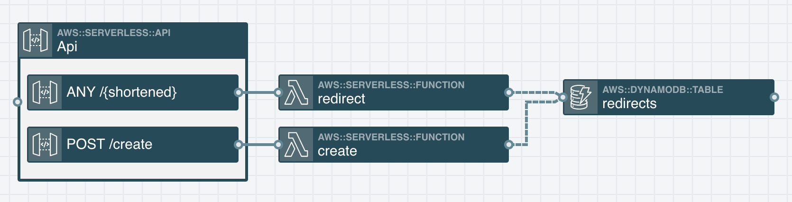

# Demo Stackery URL Shortener



After deploying this stack, you will be able to make a POST request to the /create route with a JSON body containing a URL to shorten:

```json
{
  "url": "https://example.com/my-super-long-url.html"
}
```

This will return a JSON response with the shortened URL id:

```json
{
  "id": "kjdhfb"
}
```

Then, you will be able to make a request to the shortened URL: `https://<api domain>/kjdhfb`. The response will be a 301 redirect to the long URL.